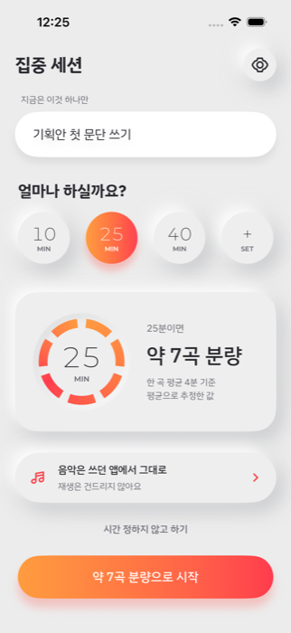
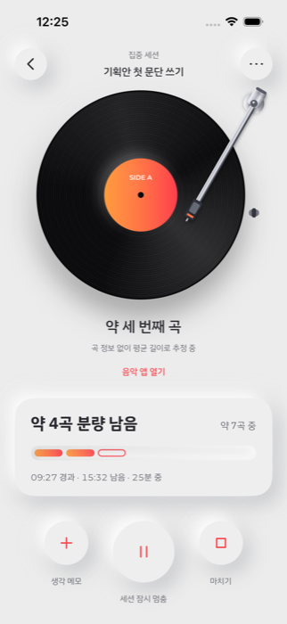
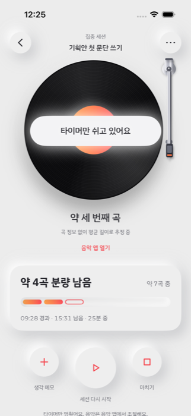
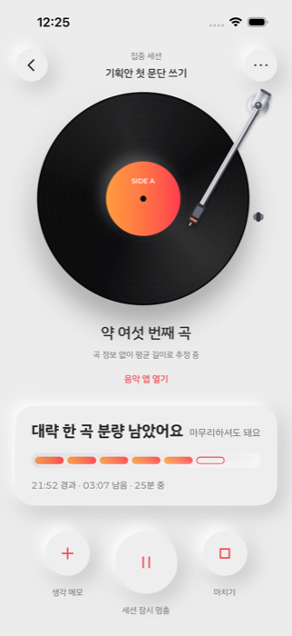
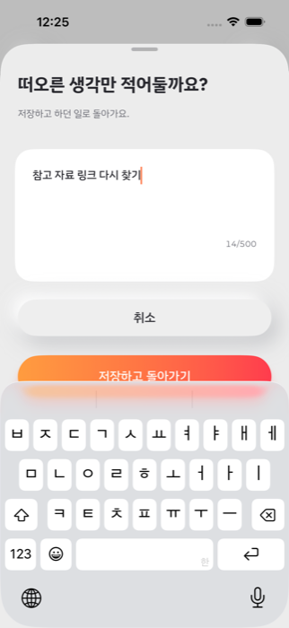
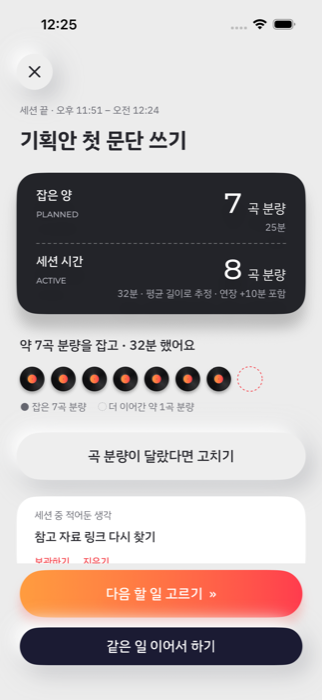
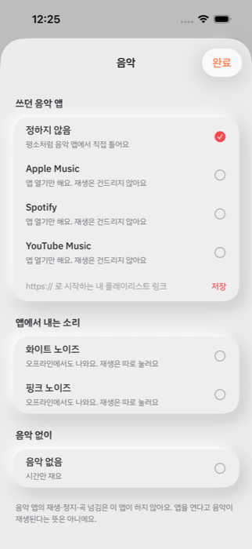
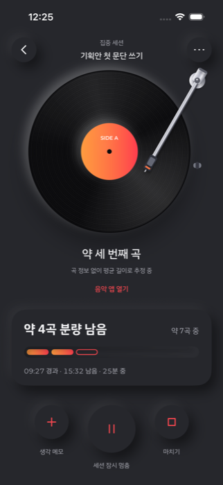
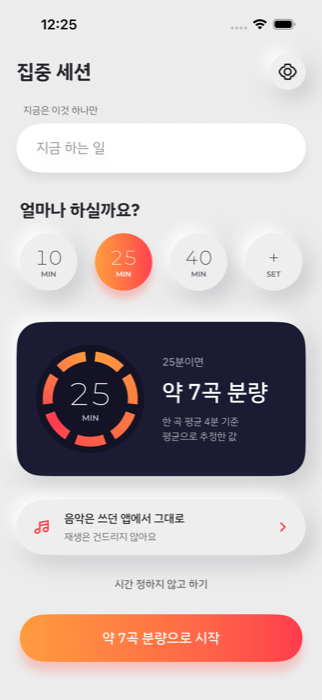

# MusicTimely

> 시간을 **곡 분량**으로 바꿔 보여주는 집중 타이머 (iOS)

"25분 집중"보다 "약 7곡 분량"이 더 잘 와닿는 사람을 위한 앱입니다. 할 일을 정하고 시간을 고르면, 평소 듣는 음악의 평균 곡 길이로 환산해 **남은 분량**을 보여줍니다. 음악은 쓰던 앱에서 그대로 듣고, 이 앱은 재생을 건드리지 않습니다.

## 목표

- **시작 장벽을 낮춘다** — 할 일 한 줄과 시간 칩 한 번이면 바로 시작합니다. 계정·로그인·권한 요구가 없습니다.
- **남은 시간을 감각으로 전달한다** — "약 4곡 분량 남음"처럼 잔여를 우선 보여주고, 끝나기 한 곡 전쯤 한 번만 알려줍니다.
- **정직하게 표시한다** — 곡 분량은 평균 길이로 계산한 **추정**입니다. 실제로 들은 곡이라고 단정하지 않고, 초과·실패·점수 표시가 없습니다.
- **음악은 사용자의 것** — 외부 음악 앱은 열기만 하고 재생·정지·곡 넘김을 하지 않습니다.

## 기능

| 시간 배정 | 진행 중 | 일시정지 |
|:---:|:---:|:---:|
|  |  |  |
| 10·25·40분 또는 1~240분 직접 입력. 고르는 즉시 "약 N곡 분량"으로 환산합니다. 시간 없이 끝날 때까지 하는 모드도 있습니다. | 검은 레코드 위에 톤암이 내려오고, 남은 곡 분량과 실제 경과·남은 시간을 함께 보여줍니다. 곡 정보가 없으니 "약 세 번째 곡"처럼 추정임을 밝힙니다. | 톤암이 거치대로 돌아가고 타이머만 멈춥니다. 음악은 음악 앱에서 조절하도록 안내합니다. |

| 마지막 분량 예고 | 생각 메모 | 결과 |
|:---:|:---:|:---:|
|  |  |  |
| 남은 시간이 한 곡 분량 이하가 되면 한 번만 알려줍니다. 정한 시간이 지나면 자동으로 끝내지 않고 +5·+10·+15분 연장을 고를 수 있습니다. | 세션 중 떠오른 생각을 적어두고 바로 하던 일로 돌아갑니다. 타이머는 계속 갑니다. | 잡은 분량과 실제 세션 시간을 나란히 비교합니다. 곡 분량이 달랐다면 표시만 고칠 수 있고, 같은 일을 이어서 하거나 다음 일로 넘어갑니다. |

| 음악 선택 | 다크 테마 | 네이비 테마 |
|:---:|:---:|:---:|
|  |  |  |
| Apple Music·Spotify·YouTube Music이나 내 플레이리스트 링크를 열거나, 앱에서 직접 내는 화이트·핑크 노이즈, 또는 음악 없이 시간만 쓸 수 있습니다. | 시스템 설정을 따르거나 설정에서 라이트·네이비·다크를 고릅니다. | |

그 밖에

- **복원** — 앱을 닫거나 기기가 잠겨도 시간이 정확히 이어집니다. 재부팅처럼 시간을 확인할 수 없으면 마지막으로 확인된 지점에서 이어갈지 물어봅니다.
- **알림** — 정한 시간이 지나면 알림을 보냅니다. 잠금 화면에 작업 제목은 넣지 않습니다.
- **노이즈** — 오프라인에서 재생되고, 시작·종료 페이드와 일시정지 시 볼륨 낮춤을 지원합니다. 통화나 헤드폰 분리 때는 소리만 멈춥니다.
- **설정** — 평균 곡 길이, 곡 분량 표시 끄기, 한 곡 반복 길이, 레코드 움직임, 소리 크기·페이드, 전체 데이터 삭제.

## 실행하기

### 요구 사항

| 도구 | 버전 |
|---|---|
| Xcode | 27 이상 (Swift 6.4) |
| XcodeGen | 2.45 이상 (`brew install xcodegen`) |
| iOS | 18.0 이상 |

### 시뮬레이터

```bash
make open     # 프로젝트를 만들고 Xcode에서 연다 (그다음 ⌘R)
make build    # iPhone 14 Pro (iOS 26.5) 시뮬레이터용 빌드
make test     # 단위·UI 테스트
```

다른 시뮬레이터를 쓰려면 `DESTINATION`을 지정합니다.

```bash
make test DESTINATION='platform=iOS Simulator,name=iPhone 17 Pro'
```

### 내 iPhone

1. Xcode → Settings → Accounts에서 Apple ID로 로그인하고 팀 ID를 확인합니다.
2. iPhone에서 설정 → 개인정보 보호 및 보안 → **개발자 모드**를 켭니다.
3. iPhone을 연결하고 실행합니다.

```bash
make device DEVELOPMENT_TEAM=<팀 ID>
```

처음 설치하면 설정 → 일반 → VPN 및 기기 관리에서 개발자 인증서를 신뢰해야 합니다.

### TestFlight

App Store Connect에 앱(번들 ID `com.gb6105.MusicTimely`)을 만들고 API 키를 발급한 뒤 실행합니다.

```bash
DEVELOPMENT_TEAM=<팀 ID> ASC_KEY_PATH=<.p8 경로> ASC_KEY_ID=<키 ID> ASC_ISSUER_ID=<발급자 ID> make testflight
```

## 업데이트 내역

### v1.0.0 — 2026-10-01

코어 기능을 처음부터 다시 구현한 첫 사용 가능 버전입니다.

- 시간 배정, 곡 분량 환산, 진행·일시정지·배정 도달·연장, 결과, 생각 메모, 곡 표시 보정, 음악 선택, 설정, 복구 화면
- 앱을 닫거나 재부팅해도 시간이 정확한 복원, 정한 시간 알림, 화이트·핑크 노이즈
- 피그마 디자인 적용: 레코드·톤암 애니메이션, 뉴모피즘 컨트롤, 라이트·네이비·다크 테마
- 앱 아이콘, 개인정보 매니페스트, 실기기 설치(`make device`)와 TestFlight 업로드(`make testflight`) 지원
- 테스트: 단위·통합 64개, UI 흐름 5개

### v0.2.0 — 2026-09-30

- 피그마 디자인 사양 정리(색·그림자·폰트·화면·톤암 모션)와 아이콘·폰트(IBM Plex Sans KR, Montserrat) 추가
- 요구사항 명세서와 PRD 추가

### v0.1.0 — 2026-09-29

- SwiftUI 프로젝트 기본 구조, 빌드·테스트·린트 명령
